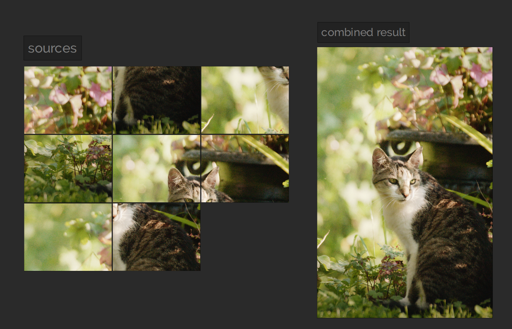

# imageGridCombine (iGC)

Convert an ordered group of images to a single "grid" combined image.



# Features

Works with the Pillow library but code could be "easily" modified to support
other libraries.

- Arbitrary size for rows and columns.
- Flexible extraction of the column/row info per-image.

# Use

Have a look at [demo.py](demo.py) for a working example.

Used as a python module :

```python
import imageGridCombine as iGC
```

It is recommended to add a logging handler for the name `iGC` before using it if you
want logging information.

Logic is as follows :
1. get a list of image
2. build an ImageGridPart instance for each image
3. build an ImageGrid instance from the ImageGridPart instances.
4. do whatever you want on it like writting to disk.

Steps 2. and 3. can be combined using `iGC.ImageGrid.build_from_paths()` method.

# API

## iGC.core

###  iGC.core.ImageGridPart

Convenient class to describe a part of an image stored into multiple crops.
Subclassing tuple to change its behavior.

Each crop is represented by its column and row number which both starts at 0.

Crop "order" use `PIL.Image` order, i.e. starting from the upper
left-corner (column=0, row=0) and going to the bottom-right corner.


###  iGC.core.ImageGrid

Describe a "grid" image which is multiple images append together in
a row/column format.

Images are appended to the final composite from left to right and top to bottom
which mean starting from row0-column0, then row0-column1, ...   
You can use `reverse_rows()` or `reverse_columns()` if your crops were using
the inverse order.

```
Attributes:
    parts: list of ImagineGridParts to combine to a single image
    image: combined image
    grid_rows: number of rows in the grid (starts at 1)
    grid_cols: number of columns in the grid (starts at 1)
```

###  iGC.core.paths_to_imagegridparts

Convert a filepath to an ImageGridPart instance. A callable must be passed that
will return which row and column the filepath correspond to.

```
Args:
    paths_list:
    crop_data_function: function that return (row, column) from a path.
        type hint:  Callable[[Path], Tuple[int, int]]

Returns:
    given images path as PIL images with their associated row/column index.
```

###  iGC.core.to_image_grid

The real core function of all this module.
Based on : https://stackoverflow.com/a/65583584/13806195

Behavior hardocoded to PIL processing from top left corner to bottom right corner

```
Args:
    imgs: list is expected to be already ordered in the PIL order. I.e. 
        starting from the upper left corner and going from left to right.
    rows:
    cols:

Returns:
    combined version of all the passed images
```

## IGC.utilities

###  iGC.utilities.get_specific_files_from_dir

From given directory return files inside matching the given parameters.
Only work at first depth level.


###  iGC.utilities.extract_crop_data

# Legal

Apache License 2.0

See [LICENSE.md](LICENSE.md) for full licence.

- ✅ The licensed material and derivatives may be used for commercial purposes.
- ✅ The licensed material may be distributed.
- ✅ The licensed material may be modified.
- ✅ The licensed material may be used and modified in private.
- ✅ This license provides an express grant of patent rights from contributors.
- 📏 A copy of the license and copyright notice must be included with the licensed material.
- 📏 Changes made to the licensed material must be documented

You can request a specific license by contacting me at [monsieurlixm@gmail.com](mailto:monsieurlixm@gmail.com) .

<a href='https://ko-fi.com/E1E3ALNSG' target='_blank'>

</a> 